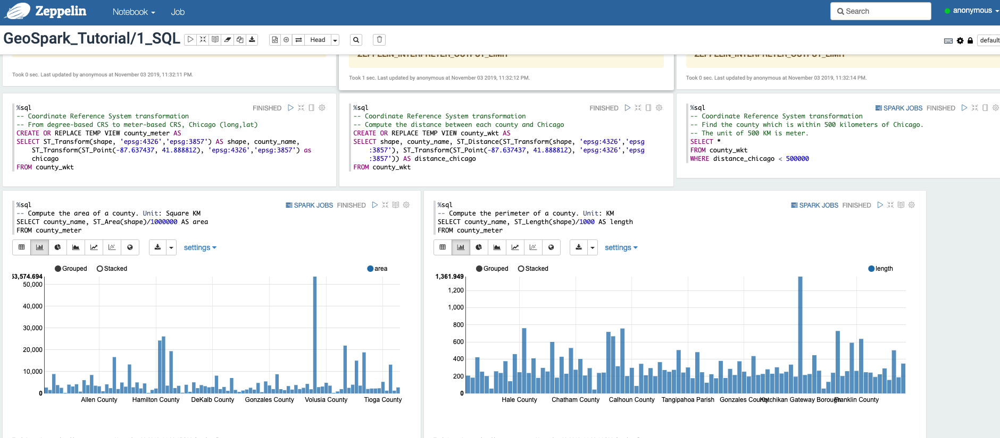
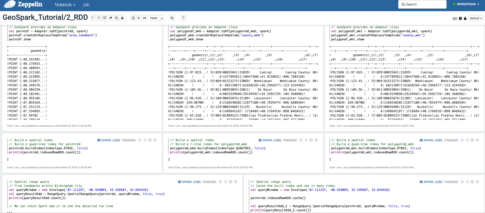
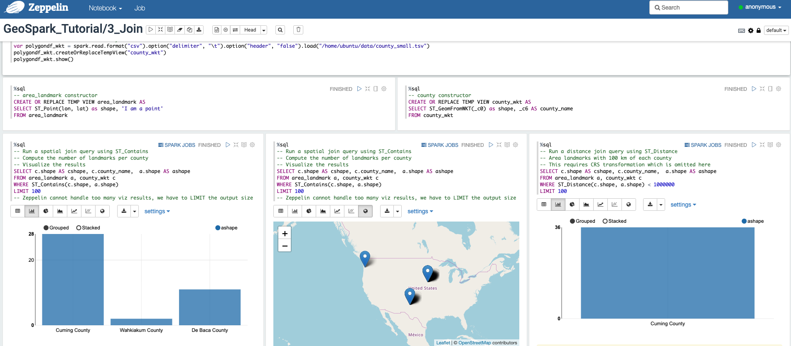
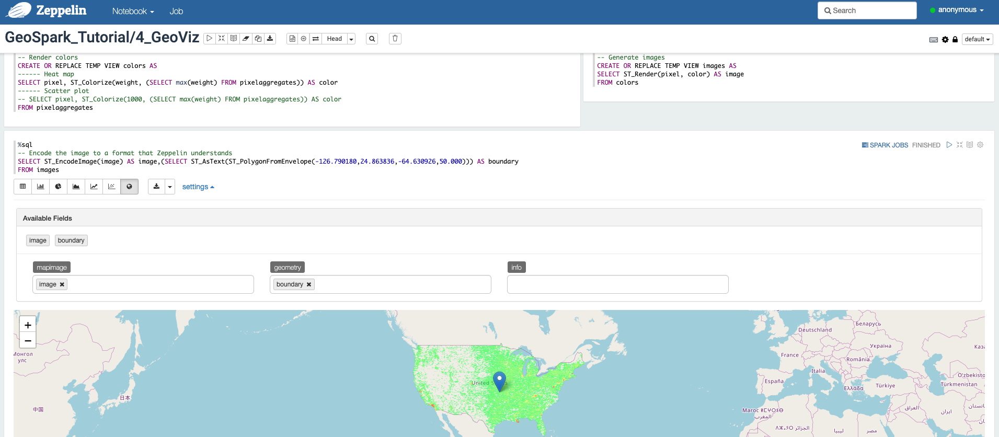
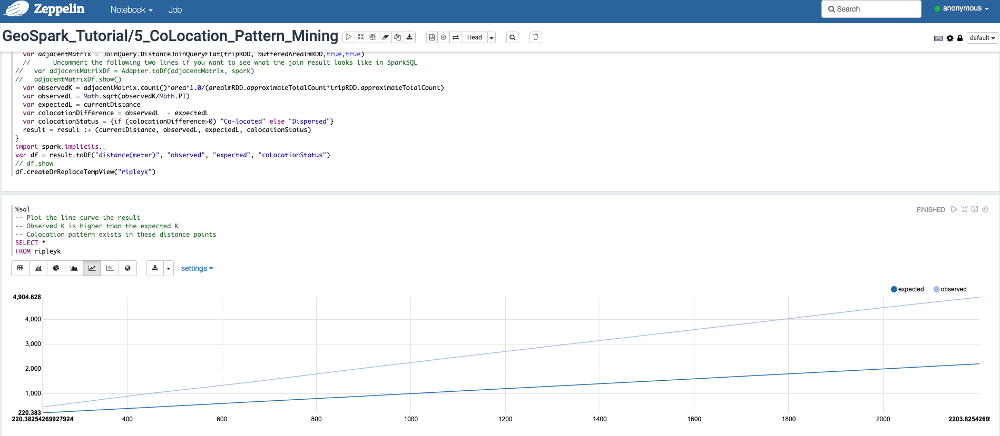

# GeoSpark and Apache Zeppelin Example

This folder includes five GeoSpark Zeppelin interactive notebooks. You can easily import these notebooks into your own Zeppelin frontend.

## GeoSpark SQL API

## GeoSpark RDD API

## GeoSpark Spatial Join query

## GeoSpark Visualization

## GeoSpark Colocation Pattern Mining

## Environment

The notebooks in this directory is tested on:

Apache Spark 2.3.3, Apache Zeppelin 0.8.1, GeoSpark 1.2.1

